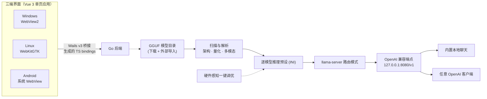

<div align="center">


# MyLlama

**一键调优 GGUF 模型，多个模型共享一个 OpenAI 兼容端点**

基于 [llama.cpp](https://github.com/ggml-org/llama.cpp) 的跨平台本地大模型客户端：扫描本地 GGUF → 可视化配置推理参数（或一键智能调优）→ 生成 llama-server 预设 → 一个 OpenAI 兼容端点，供内置聊天与任意客户端使用。模型下载、本地聊天与实时监控开箱即用，所有数据不出本机。


Windows x64 · Android arm64 · Linux x64 · GPL-3.0

简体中文 · [English](README_en.md)

[](https://github.com/CodeNeow/llama-cpp-desktop/releases)
[](https://github.com/CodeNeow/llama-cpp-desktop/releases)
[](LICENSE)
[](https://github.com/CodeNeow/llama-cpp-desktop/actions)
[](https://go.dev/dl/)
[](https://wails.io/)
[](https://vuejs.org/)

</div>

---

## ✨ 为什么选择 MyLlama

<table>
<tr>
<td width="50%" valign="top">

**🔒 本地优先 · 隐私无忧**<br/>
模型、对话与推理数据全部留在本机：无遥测、无云端依赖，断网也能完整使用——数据去哪儿只由你决定。

</td>
<td width="50%" valign="top">

**🎯 一键智能调优**<br/>
读取 GGUF 真实指标（层数、注意力头、KV 几何、训练上下文、MoE 专家占比），结合硬件快照与实测内存带宽，为每个模型自动规划推理参数。

</td>
</tr>
<tr>
<td width="50%" valign="top">

**⚡ 推理性能细节**<br/>
n-gram 投机解码零额外显存、q8_0 KV 缓存量化撑起更长上下文、flash-attention 开关、多卡显存切分模式、Windows 全量 offload 启动钉定，逐模型 llama-bench 实测验收。

</td>
<td width="50%" valign="top">

**🖥️ 三端一体体验**<br/>
同一套 Go + Vue 3 代码覆盖 Windows / Linux / Android：手机档自动切换底部导航并适配安全区，深浅主题、中英双语界面与内置教程全端一致。

</td>
</tr>
<tr>
<td width="50%" valign="top">

**🔁 OpenAI 兼容生态**<br/>
llama-server 以路由模式运行，目录下所有 GGUF 汇聚成一个 OpenAI 兼容端点：模型按需懒加载、空闲一键卸载，任意 OpenAI 客户端即插即用。

</td>
<td width="50%" valign="top">

**📦 模型获取与管理**<br/>
HF 镜像 + ModelScope 双源搜索，批量下载走可断点续传的任务队列（重启自动恢复）；GGUF 元数据解析（架构 / 量化一览），支持外部导入目录。

</td>
</tr>
<tr>
<td width="50%" valign="top">

**📊 可视化监控**<br/>
提示处理 / 生成 tok/s 双指标与近 60 秒速度曲线，GPU、内存、CPU 实时采样，服务日志控制台按游标增量刷新、落盘不丢失。

</td>
<td width="50%" valign="top">

**💤 无头 API 模式**<br/>
（Windows）一个开关切换为纯后台运行（托盘 + llama-server）：GUI ↔ 后台零中断交接服务进程，回环控制面提供健康检查、状态、日志与停止接口。

</td>
</tr>
</table>

<details>
<summary><b>📖 目录</b></summary>

- [✨ 为什么选择 MyLlama](#-为什么选择-myllama)
- [🎨 界面与设计](#-界面与设计)
- [🚀 快速开始](#-快速开始)
  - [Windows](#windows) · [Android](#android) · [Linux](#linux) · [macOS](#macos)
  - [首次使用（三步上手）](#首次使用三步上手)
- [🧠 一键调优](#-一键调优)
- [🔌 API 接入](#-api-接入)
- [🔧 配置](#-配置)
- [🧱 架构](#-架构)
- [🔨 从源码构建](#-从源码构建)
- [❓ 常见问题](#-常见问题)
- [📄 协议与致谢](#-协议与致谢)

</details>

---

## 🎨 界面与设计

> 以下为 UI 设计稿的渲染图（桌面 1280×800、手机 390×844，浅色与深色双主题；设计源文件见 [docs/branding](docs/branding)），用于展示界面布局与视觉风格，实际界面以各平台发布版本为准。

**桌面端 · 浅色主题**

<table>
<tr>
<td width="50%" align="center">

<br/>
<i>首页 · 系统信息与快速开始</i>

</td>
<td width="50%" align="center">

<br/>
<i>本地聊天 · 流式对话与深度思考</i>

</td>
</tr>
<tr>
<td width="50%" align="center">

<br/>
<i>模型管理 · 下载与我的模型</i>

</td>
<td width="50%" align="center">

<br/>
<i>API 路由 · 服务控制与实时监控</i>

</td>
</tr>
</table>

**桌面端 · 深色主题**

<table>
<tr>
<td width="50%" align="center">

<br/>
<i>首页 · 系统信息（深色主题）</i>

</td>
<td width="50%" align="center">

<br/>
<i>本地聊天（深色主题）</i>

</td>
</tr>
<tr>
<td width="50%" align="center">

<br/>
<i>模型管理（深色主题）</i>

</td>
<td width="50%" align="center">

<br/>
<i>API 路由（深色主题）</i>

</td>
</tr>
</table>

**Android · 直连模式**

<table>
<tr>
<td width="33%" align="center">

<br/>
<i>主页</i>

</td>
<td width="33%" align="center">

<br/>
<i>聊天</i>

</td>
<td width="33%" align="center">

<br/>
<i>模型</i>

</td>
</tr>
<tr>
<td width="33%" align="center">

<br/>
<i>API 路由</i>

</td>
<td width="33%" align="center">

<br/>
<i>偏好设置</i>

</td>
<td width="33%" align="center">

<br/>
<i>灵动任务卡片 · 悬浮任务胶囊</i>

</td>
</tr>
</table>

**各页面速览**

| 页面 | 用途 |
| --- | --- |
| **首页** | 「系统信息」自动检测 CPU / 内存 / GPU / CUDA 并实时采样（含 Blackwell 显卡兼容性判定）；「运行环境」一键下载 llama.cpp 或指定自定义目录，落地标签智能选择 |
| **聊天** | 流式本地对话：Markdown 渲染、可折叠思考过程、图片附件、生成预设（精准 / 均衡 / 创意 / 随机 + 自定义）与会话级采样参数；发送即自动拉起服务 |
| **模型** | 「下载」：HF 镜像 / Hugging Face / ModelScope 三源搜索 + 文件级断点续传队列；「我的模型」：扫描解析（架构 / 量化 / 多模态识别）、一键调优与逐模型参数设置 |
| **API** | 服务启停、tok/s 双指标与速度曲线、游标增量式服务日志、已加载模型管理与一键卸载；端口 / 最大并发 / Prompt 缓存配置 |
| **设置** | 主题 / 语言（zh · en · auto）/ 下载源 / 目录 / 服务访问范围与推理显卡 / Windows 托盘 / API 路由模式 / 检查更新；「帮助与教程」入口进入内置双语教程（在线更新） |

---

## 🚀 快速开始

### Windows

前往 [Releases 最新版](https://github.com/CodeNeow/llama-cpp-desktop/releases/latest) 下载 `MyLlama-setup-*-windows-amd64.exe`，双击安装即可（安装包内嵌 WebView2 Runtime 引导器，系统缺失时自动安装）。应用内置自动更新，后续新版本无需手动重装。

环境要求：Windows 10 及以上（x64）。

### Android

前往 [Releases 最新版](https://github.com/CodeNeow/llama-cpp-desktop/releases/latest) 下载 `MyLlama-*-android-arm64.apk`（arm64 设备，Android 5.0+），安装时按提示允许「安装未知来源应用」。应用内「偏好设置 → 检查更新」可下载新版本并由系统安装器完成升级；应用内自更新要求新旧版本使用同一签名（Release 发布的 APK 均以稳定密钥签名），本地 debug 签名的构建请先卸载旧版再安装。

### Linux

Releases 提供 Ubuntu 22.04 / 24.04 的 `.deb` 包：下载 `myllama_*_amd64.deb` 后安装（`sudo apt install ./myllama_*_amd64.deb`），GTK / WebKit 运行库由包依赖自动解析。其他发行版可参考[从源码构建](#-从源码构建)。

### macOS

暂无预构建发行包；代码库仍支持从源码构建（Apple Silicon 使用 Metal 加速），参见[从源码构建](#-从源码构建)。

### 首次使用（三步上手）

1. **装运行环境** — 在**首页**的「运行环境」标签点击「下载 llama.cpp」从 GitHub 获取最新版（支持断点续传），也可指定已有的 llama.cpp 目录。
2. **下模型** — 在**模型**页的「下载」标签搜索 HF 镜像 / Hugging Face / ModelScope，把 GGUF 文件下载到模型目录（默认 `LLM-Models/`）；进度显示在右下角的灵动任务卡片中。
3. **开聊** — 打开**聊天**页选择模型，直接发送消息即可开始对话——发送时会自动拉起本地服务并按需加载所选模型，无需手动启动。

> 进阶：需要在其他 OpenAI 兼容客户端中使用，或手动管理服务时，到 **API** 页点击「启动服务」（默认 `127.0.0.1:8080`），接入方式见 [API 接入](#-api-接入)。

---

## 🧠 一键调优

「这个模型在我机器上到底该怎么跑？」——在**模型设置**页点一下「一键调优」，MyLlama 用真实数据替你回答。

**输入：实测 + 解析**

| 输入 | 来源 |
| --- | --- |
| 层数、注意力头数、KV 几何、训练上下文、MoE 专家占比 | GGUF 头解析 |
| GPU 厂商与显存、内存、CPU 核心数；Android 上识别 SoC 型号与 big.LITTLE 性能核数 | 硬件快照 |
| 全核流式读取实测内存带宽（按硬件指纹缓存，跨机自动作废） | 带宽校准 |

**输出：可执行的推理方案**

- 在**全量 GPU offload / MoE `--cpu-moe` 分载 / 部分分层 offload / 纯 CPU** 四档策略中自动选择：全量 offload 后上下文局促时，自动转向「cpu-moe 分载 + 大上下文」；
- 规划上下文阶梯与 KV 缓存量化（q8_0），在显存预算内撑起尽可能长的上下文；
- 调优结果实时填入参数表单，可继续微调；「深度实测」用自带 llama-bench 跑一轮真实解码速度，为方案做实测验收。

---

## 🔌 API 接入

服务启动后，任意 OpenAI 兼容客户端均可接入：

```bash
OPENAI_BASE_URL="http://127.0.0.1:8080/v1"
OPENAI_API_KEY="sk-任意占位值"   # 本地服务默认不鉴权；可在偏好设置中配置 API Key
```

`model` 字段直接填页面上显示的模型名（从 API 页的模型标签或模型页「我的模型」复制即可），llama-server 会按需加载 / 卸载模型，内存中的模型也可以在任务卡片中手动卸载。快速自测：

```bash
curl http://127.0.0.1:8080/v1/chat/completions \
  -H "Content-Type: application/json" \
  -d '{"model":"模型名","messages":[{"role":"user","content":"你好"}]}'
```

Windows 无头（API 路由）模式下端点照常可用，另有仅回环可达的控制面 `127.0.0.1:1900`（`/health`、`/status`、`/logs`、`/stop`，可选 token 鉴权），便于脚本与外部工具管理后台服务。

---

## 🔧 配置

运行时配置持久化在 `llama-desktop-config.json`，存放位置随平台不同（由 `core/paths.go` 统一解析）：

- **Windows**：进程工作目录（通常为安装目录）；
- **Linux**：应用数据目录 `~/.config/llama-desktop/`；
- **macOS**（源码构建）：`~/Library/Application Support/llama-desktop/`；
- **Android**：应用私有数据目录（`/data/data/<包名>/files/`）。

主要字段：

| 字段 | 含义 | 默认值 |
| --- | --- | --- |
| `theme` | 主题：`light` / `dark` | `light` |
| `language` | 界面语言：`zh` / `en` / `auto`（auto 跟随系统语言） | `auto` |
| `downloadSource` | 默认下载源：`hf`（HF 镜像）/ `huggingface`（官方）/ `modelscope` | `hf` |
| `trayEnabled` | 系统托盘，关闭窗口最小化到托盘（Windows） | `true` |
| `sidebarCollapsed` | 侧边栏是否默认收起 | `true` |
| `apiRouteMode` | API 路由（无头）模式（Windows）：下次启动后仅以托盘 + llama-server 后台运行，不显示界面 | `false` |
| `serverConfig` | `accessMode`（`local` / `lan`）、`host`、`port`、`maxModels`、`cacheRam`（MiB）、`apiKey`（可选鉴权）、`deviceId`（推理 GPU 绑定） | `127.0.0.1:8080`，`maxModels` 1，`cacheRam` 8192，不鉴权，GPU 自动 |

此外还保存：`llamaCppDownloadDir` / `modelDownloadDir`（下载路径）与 `llamaCppDir` / `modelDir`（外部导入目录）、`modelConfigs`（逐模型推理参数）、`downloadTasks`（下载任务队列，重启后恢复）、`onboardingDismissed`（首页快速开始清单是否已关闭）。

---

## 🧱 架构



前端是 Vue 3 单页应用，经 Wails v3 桥接（构建时生成的 TypeScript bindings）调用 Go 后端；同一套前端分别渲染在 Windows 的 WebView2、Linux 的 WebKitGTK 与 Android 的系统 WebView 中。后端负责扫描模型目录、解析 GGUF 元数据、生成逐模型推理预设并拉起 llama-server。llama-server 以路由模式运行，把目录下所有 GGUF 汇聚成一个 OpenAI 兼容端点，模型按需加载 / 卸载——内置聊天与任意 OpenAI 客户端都接在这同一个端点上（Android 为直连模式：单个常驻模型，随聊天页拉起）。

---

## 🔨 从源码构建

- [Git](https://git-scm.com/)、[Go](https://go.dev/dl/) 1.25+、[Node.js](https://nodejs.org/) 18+
- Wails v3 CLI（与 go.mod 中的 v3 版本一致）：

  ```bash
  go install github.com/wailsapp/wails/v3/cmd/wails3@v3.0.0-beta.16
  ```

- 平台依赖：
  - **Windows**：WebView2 Runtime（Windows 10/11 一般已内置）；
  - **Linux**：GTK4 与 WebKitGTK 6.0 开发包，如 `sudo apt install libgtk-4-dev libwebkitgtk-6.0-dev pkg-config`（Debian/Ubuntu；Releases 中的 `.deb` 使用 `-tags gtk3` 变体构建，对应 GTK3 + WebKit2GTK 4.1）；
  - **Android**：JDK 17 与 Android SDK / NDK（`sdkmanager "ndk;26.3.11579264" "platforms;android-35"`），构建任务详见 [Taskfile.yml](Taskfile.yml) 的 android 段与 [CI 配置](.github/workflows/ci.yml)；
  - **macOS**：无预构建发行包，源码构建可用（Apple Silicon 走 Metal）。

克隆仓库并构建：

```bash
git clone https://github.com/CodeNeow/llama-cpp-desktop.git
cd llama-cpp-desktop
wails3 task build            # Windows / Linux / macOS 桌面版
wails3 task android:package  # Android arm64 APK（需先构建前端，输出到 build/bin/）
```

开发模式（Go 后端 + Vite 前端热重载，开发服务器固定在 `http://localhost:5173`）：

```bash
wails3 task dev
```

组合质量门禁：

```bash
powershell -NoProfile -ExecutionPolicy Bypass -File .\scripts\check.ps1     # Windows
make check                                                                  # POSIX
```

门禁会运行后端的 `go build` / `go test` / `gofmt` / `golangci-lint` 与前端的 `npm run build`（vue-tsc + vite）；PowerShell 脚本还会运行 vitest 测试套件（`npm test`）。后端测试位于 `core/*_test.go`（标准库 `testing`，含基于真实 llama-server 的服务链路 E2E），前端测试位于 `frontend/src/__tests__/`。开发约定、提交格式与协作流程详见 [AGENTS.md](AGENTS.md) 与 [CONTRIBUTING.md](CONTRIBUTING.md)。

---

## ❓ 常见问题

**启动时提示应用已在运行。**
应用使用单实例互斥锁，重复启动会被阻止（无头模式 → 界面模式的交接窗口内重试亦被覆盖）。请先关闭正在运行的 MyLlama（包括托盘里的后台实例），再重新启动。

**`wails3 task dev` 提示端口被占用。**
Vite 开发服务器绑定 `localhost:5173`（Taskfile 的 `VITE_PORT`，可用 `WAILS_VITE_PORT` 环境变量覆盖）。请结束占用该端口的进程后重试。

**API 页「启动服务」失败，提示找不到模型。**
启动流程会先扫描模型目录并生成预设，目录为空时会报错。请先将 GGUF 文件放入 `LLM-Models/`（可在模型页「我的模型」标签确认），然后重试；同时请在首页「运行环境」标签确认 llama.cpp 已安装。

**调用 API 报 `model not found`。**
`model` 字段必须与页面显示的模型名大小写完全一致（服务按精确匹配）。请从 API 页的模型标签或模型页「我的模型」标签复制粘贴，不要手打。

**单独运行 `npm run dev` 时所有后端调用都失败。**
前端通过 Wails v3 构建时生成的 bindings 调用 Go 后端，脱离 `wails3 task dev` 的 Vite 没有通往后端的桥接层，调用会在请求阶段失败——这是预期行为。调试 UI 请使用 `wails3 task dev`（或在 mock 模式下用 `npm run dev:mock` 纯浏览器预览）。

**Linux 源码构建报 GTK / WebKit 依赖缺失。**
Wails v3 的 Linux 构建走 cgo：默认路径需要 GTK4 与 WebKitGTK 6.0 开发包（`libgtk-4-dev`、`libwebkitgtk-6.0-dev`），`-tags gtk3` 变体需要 `libgtk-3-dev`、`libwebkit2gtk-4.1-dev`。按所选构建变体用包管理器安装对应开发包与 `pkg-config` 后重新构建。

**Android 无法安装或应用内更新失败。**
安装 APK 需允许「安装未知来源应用」。应用内自更新要求设备上已安装的版本与新 APK 使用同一签名——Release 发布的 APK 使用稳定签名密钥，本地 debug 签名或其他来源的构建无法互相覆盖升级；签名不一致时请先卸载旧版再安装。本应用为侧载分发（不上架应用商店），更新包始终从 GitHub Releases 获取。

**下载 llama.cpp 很慢或失败。**
下载源为 GitHub Releases，支持暂停 / 继续与断点续传。网络受限时可手动下载对应平台的发行包并解压，然后在首页「运行环境」标签通过「自定义」选择该目录。

---

## 📄 协议与致谢

Copyright © 2026 [CodeNeow](https://github.com/CodeNeow/llama-cpp-desktop)

本项目基于 [GNU General Public License v3](LICENSE) 开源。

MyLlama 站在这些开源项目的肩膀上，一并致谢：

- [llama.cpp](https://github.com/ggml-org/llama.cpp)（ggml / GGUF 生态）— 高性能本地推理引擎；
- [Wails](https://wails.io/) — 用 Go + Web 技术栈构建跨平台桌面 / 移动应用的框架；
- [Vue](https://vuejs.org/) 与 [Vite](https://vitejs.dev/) — 前端框架与构建工具链；
- [hf-mirror.com](https://hf-mirror.com)、[Hugging Face](https://huggingface.co) 与 [ModelScope](https://modelscope.cn) — 开放共享的模型生态。

第三方模型文件版权归其各自作者所有，下载与使用请遵循对应模型的开源许可协议。
