<div align="center">


# MyLlama

**One-click tuning for GGUF models, many models behind one OpenAI-compatible endpoint**

A cross-platform local-LLM client built on [llama.cpp](https://github.com/ggml-org/llama.cpp): scan local GGUF files → configure inference parameters visually (or one-click auto-tune) → generate llama-server presets → serve one OpenAI-compatible endpoint for the built-in chat and any OpenAI client. Model downloads, local chat and live monitoring are built in — everything stays on your machine.

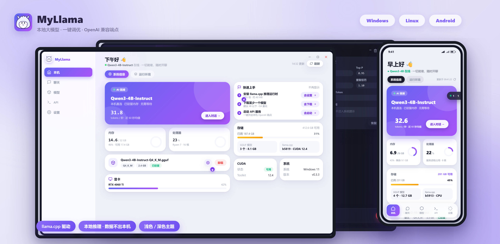

Windows x64 · Android arm64 · Linux x64 · GPL-3.0

[简体中文](README.md) · English

[](https://github.com/CodeNeow/llama-cpp-desktop/releases)
[](https://github.com/CodeNeow/llama-cpp-desktop/releases)
[](LICENSE)
[](https://github.com/CodeNeow/llama-cpp-desktop/actions)
[](https://go.dev/dl/)
[](https://wails.io/)
[](https://vuejs.org/)

</div>

---

## ✨ Why MyLlama

<table>
<tr>
<td width="50%" valign="top">

**🔒 Local-first · Privacy by design**<br/>
Models, conversations and inference data never leave your machine: no telemetry, no cloud dependency, fully usable offline — you decide where your data goes.

</td>
<td width="50%" valign="top">

**🎯 One-click smart tuning**<br/>
Reads real GGUF metrics (layers, attention heads, KV geometry, trained context, MoE expert split) and combines them with a hardware snapshot plus a measured RAM-bandwidth calibration to plan inference parameters per model.

</td>
</tr>
<tr>
<td width="50%" valign="top">

**⚡ Inference performance details**<br/>
n-gram speculative decoding with zero extra VRAM, q8_0 KV-cache quantization for longer contexts, a flash-attention toggle, multi-GPU split modes, Windows full-offload launch pins — validated per model with llama-bench.

</td>
<td width="50%" valign="top">

**🖥️ One experience, three platforms**<br/>
A single Go + Vue 3 codebase covers Windows / Linux / Android: the phone tier switches to bottom navigation with safe-area support, and themes, the zh / en UI and the built-in tutorial are consistent everywhere.

</td>
</tr>
<tr>
<td width="50%" valign="top">

**🔁 OpenAI-compatible ecosystem**<br/>
llama-server runs in router mode, serving every GGUF in your directory behind one OpenAI-compatible endpoint: models lazy-load on demand, unload in one click when idle, and any OpenAI client just plugs in.

</td>
<td width="50%" valign="top">

**📦 Model discovery and management**<br/>
Dual-source search across HF Mirror and ModelScope, batch downloads through a resumable queue that survives restarts, GGUF metadata parsing (architecture / quantization at a glance) and imported external directories.

</td>
</tr>
<tr>
<td width="50%" valign="top">

**📊 Visual monitoring**<br/>
Dual prompt-processing / generation tok/s metrics with a 60-second speed chart, live GPU / memory / CPU sampling, and a server-log console with cursor-based incremental refresh persisted to disk.

</td>
<td width="50%" valign="top">

**💤 Headless API mode**<br/>
(Windows) One toggle switches to background-only operation (tray + llama-server): GUI ↔ headless switches hand the server process over with zero downtime, and a loopback-only control plane serves health, status, logs and stop.

</td>
</tr>
</table>

<details>
<summary><b>📖 Table of Contents</b></summary>

- [✨ Why MyLlama](#-why-myllama)
- [🎨 UI and Design](#-ui-and-design)
- [🚀 Getting Started](#-getting-started)
  - [Windows](#windows) · [Android](#android) · [Linux](#linux) · [macOS](#macos)
  - [First Run in Three Steps](#first-run-in-three-steps)
- [🧠 One-Click Auto-Tune](#-one-click-auto-tune)
- [🔌 API Access](#-api-access)
- [🔧 Configuration](#-configuration)
- [🧱 Architecture](#-architecture)
- [🔨 Build from Source](#-build-from-source)
- [❓ FAQ](#-faq)
- [📄 License and Acknowledgements](#-license-and-acknowledgements)

</details>

---

## 🎨 UI and Design

> The images below are renders of the UI design mockups (desktop 1280×800, phone 390×844, light and dark themes; source drafts in [docs/branding](docs/branding)). They showcase layout and visual style; the shipped UI on each platform is the reference.

**Desktop · Light theme**

<table>
<tr>
<td width="50%" align="center">

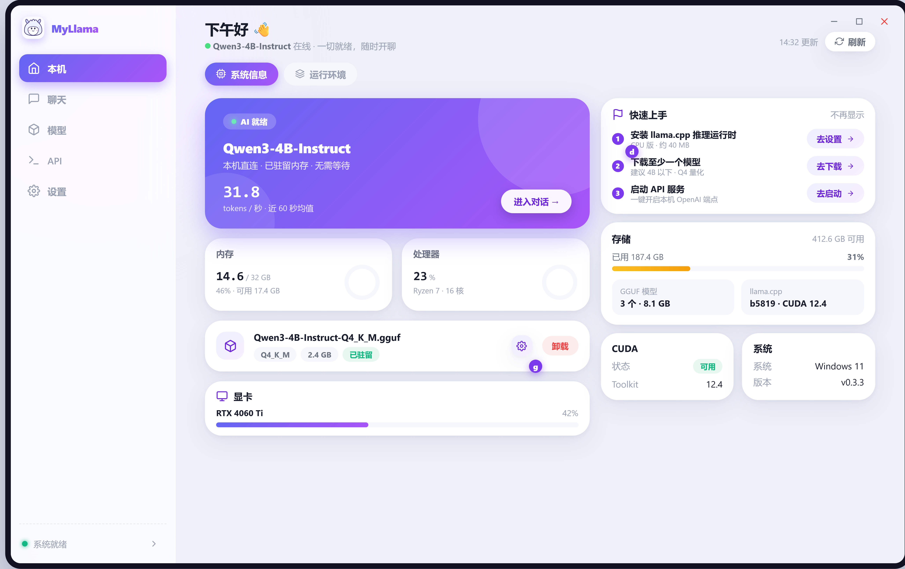<br/>
<i>Home · system info & quick start</i>

</td>
<td width="50%" align="center">

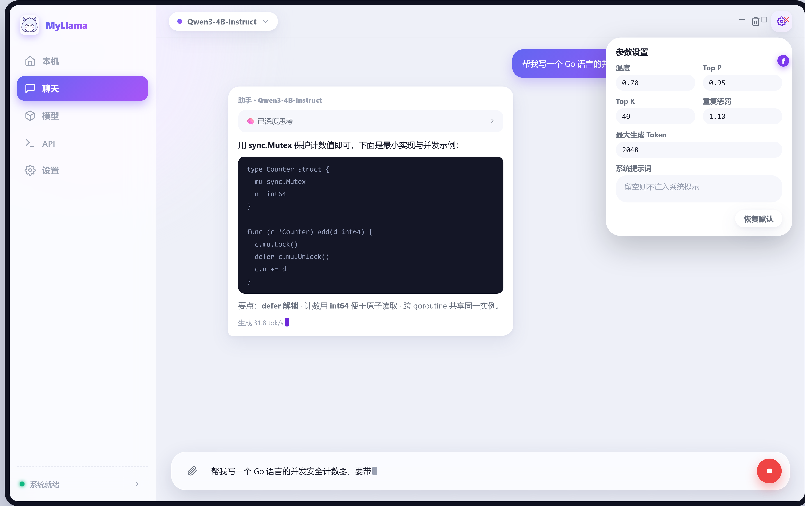<br/>
<i>Local chat · streaming with deep-thinking blocks</i>

</td>
</tr>
<tr>
<td width="50%" align="center">

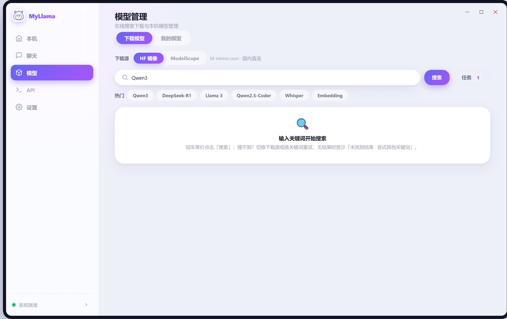<br/>
<i>Models · downloads & my models</i>

</td>
<td width="50%" align="center">

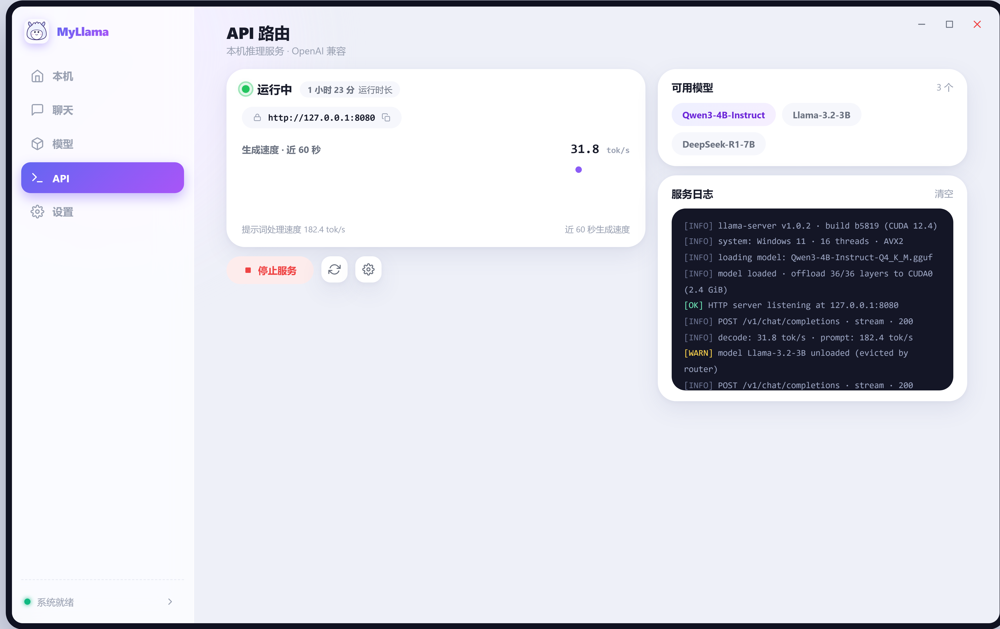<br/>
<i>API router · service control & live monitoring</i>

</td>
</tr>
</table>

**Desktop · Dark theme**

<table>
<tr>
<td width="50%" align="center">

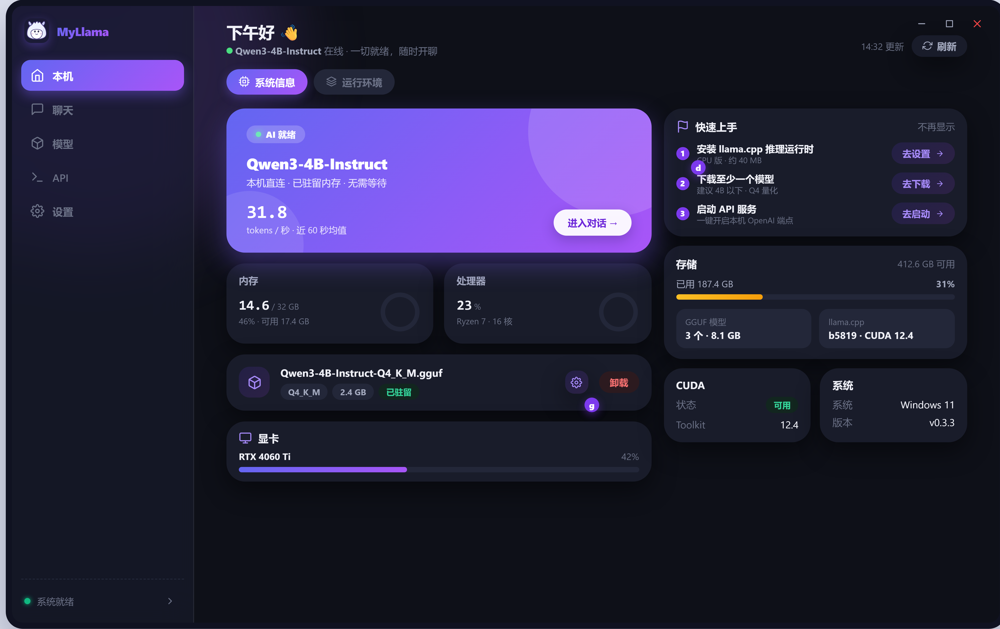<br/>
<i>Home · system info (dark theme)</i>

</td>
<td width="50%" align="center">

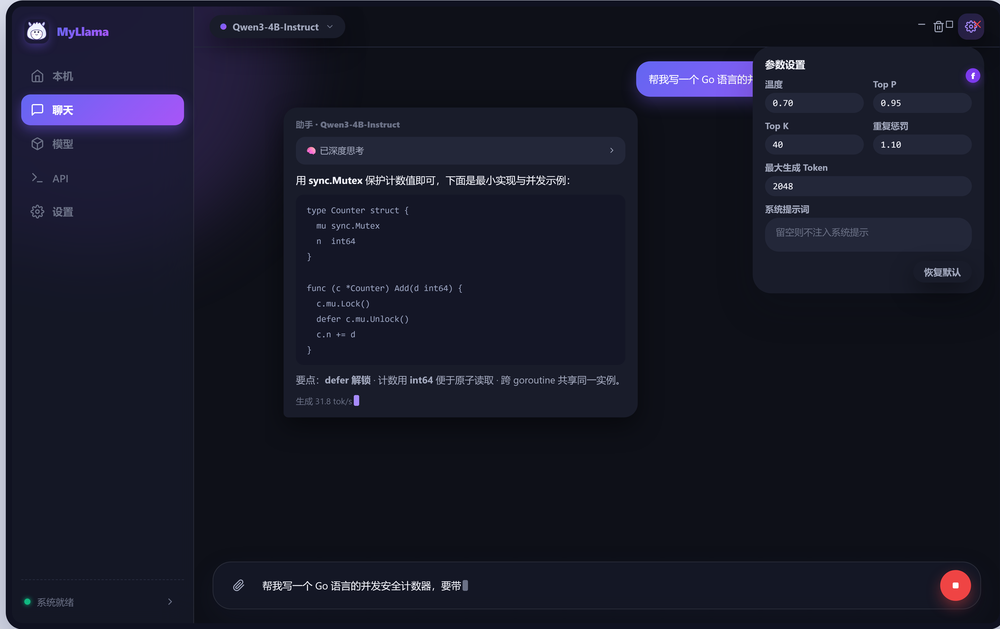<br/>
<i>Local chat (dark theme)</i>

</td>
</tr>
<tr>
<td width="50%" align="center">

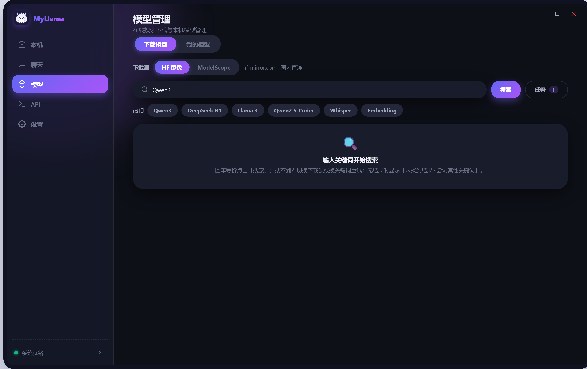<br/>
<i>Models (dark theme)</i>

</td>
<td width="50%" align="center">

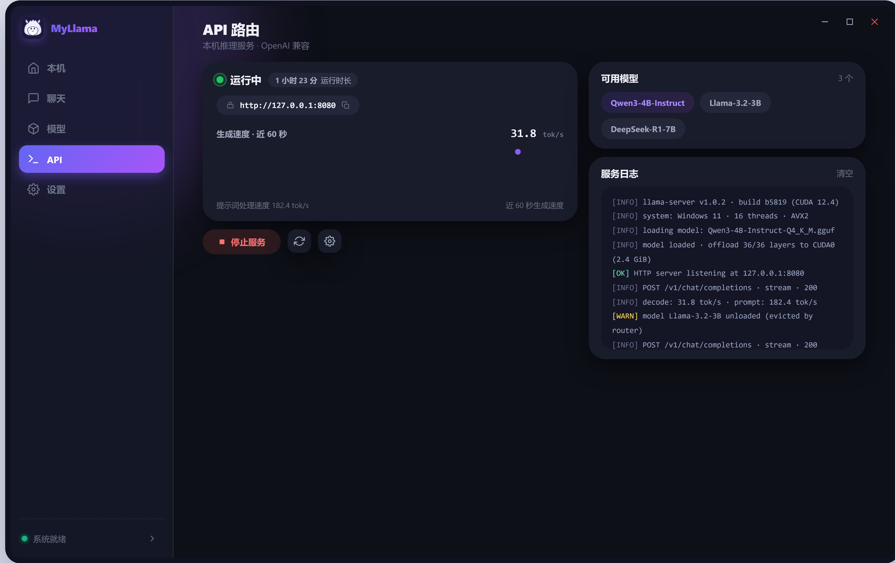<br/>
<i>API router (dark theme)</i>

</td>
</tr>
</table>

**Android · Direct mode**

<table>
<tr>
<td width="33%" align="center">

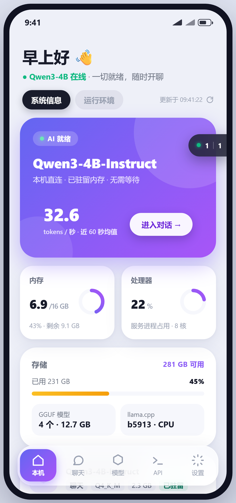<br/>
<i>Home</i>

</td>
<td width="33%" align="center">

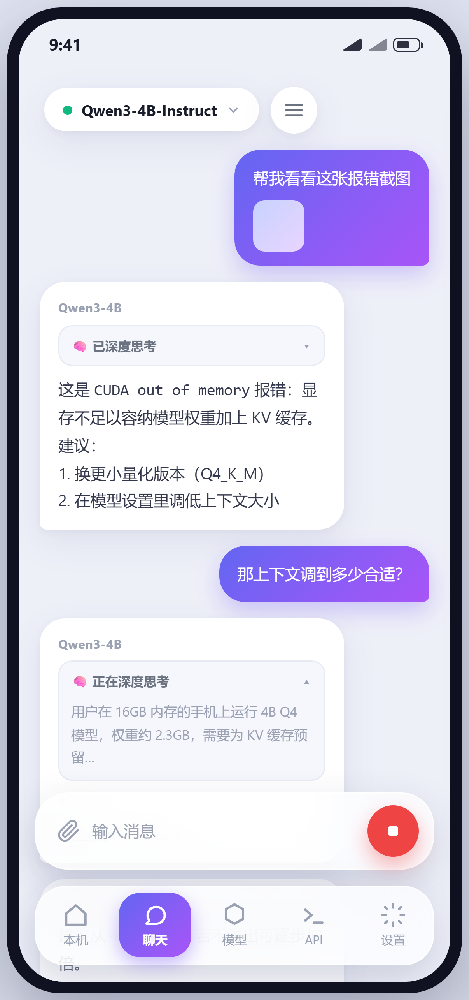<br/>
<i>Chat</i>

</td>
<td width="33%" align="center">

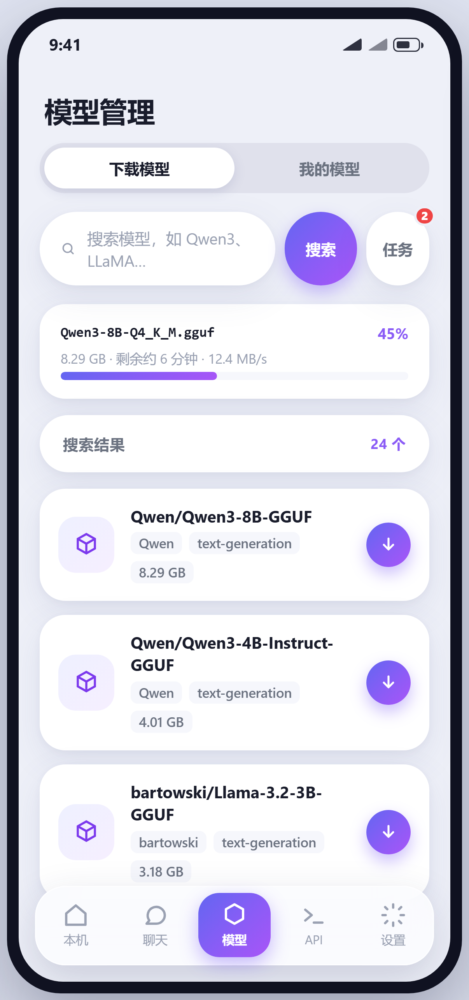<br/>
<i>Models</i>

</td>
</tr>
<tr>
<td width="33%" align="center">

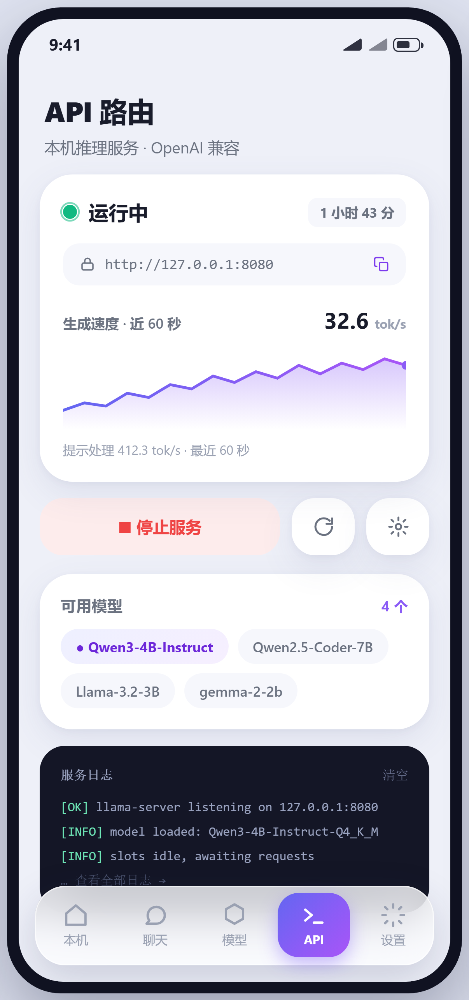<br/>
<i>API router</i>

</td>
<td width="33%" align="center">

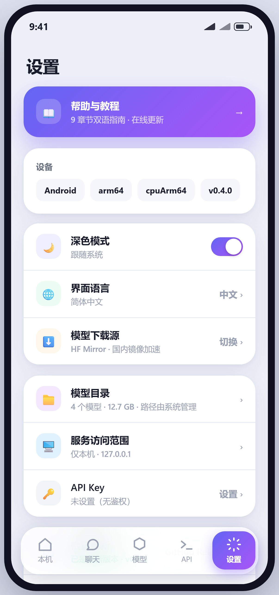<br/>
<i>Preferences</i>

</td>
<td width="33%" align="center">

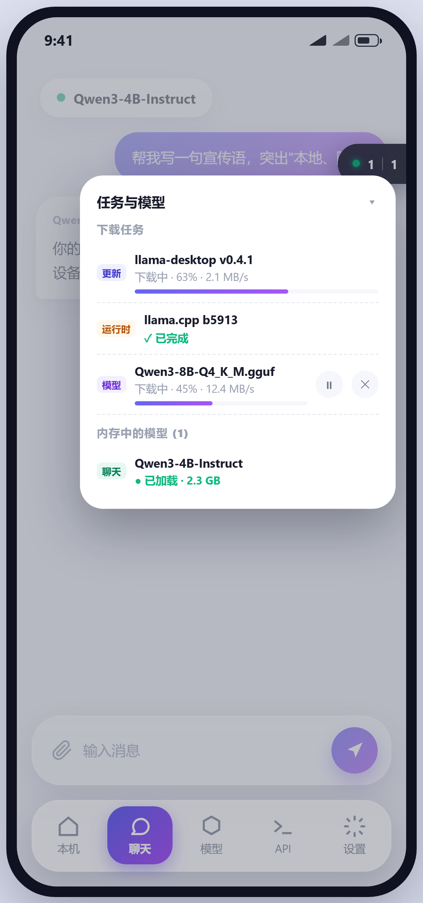<br/>
<i>Task dock · the floating capsule</i>

</td>
</tr>
</table>

**Pages at a glance**

| Page | Purpose |
| --- | --- |
| **Home** | "System Info" detects CPU / memory / GPU / CUDA with live sampling (including Blackwell compatibility verdicts); "Runtime Environment" one-click downloads llama.cpp or points at a custom directory, with a smart landing tab |
| **Chat** | Streaming local conversations: Markdown rendering, foldable deep-thinking blocks, image attachments, generation presets (precision / balanced / creative / random + custom) and per-session sampling; sending auto-starts the service |
| **Models** | "Download": tri-source search (HF Mirror / Hugging Face / ModelScope) with a file-level resumable queue; "My Models": scan & parse (architecture / quantization / multimodal detection), one-click auto-tune and per-model settings |
| **API** | Start / stop the service, dual tok/s metrics and the speed chart, cursor-incremental server log, loaded-model management with one-click unload; port / max-concurrency / prompt-cache options |
| **Settings** | Theme / language (zh · en · auto) / download source / directories / access scope & serving GPU / Windows tray / API-route mode / update check; the "Help & Tutorial" card opens the built-in bilingual tutorial (updated online) |

---

## 🚀 Getting Started

### Windows

Grab `MyLlama-setup-*-windows-amd64.exe` from the [latest release](https://github.com/CodeNeow/llama-cpp-desktop/releases/latest) and double-click to install (the installer embeds the WebView2 Runtime bootstrapper and installs it automatically if missing). The app updates itself, so later versions need no manual reinstall.

Requirements: Windows 10 or later (x64).

### Android

Grab `MyLlama-*-android-arm64.apk` from the [latest release](https://github.com/CodeNeow/llama-cpp-desktop/releases/latest) (arm64 devices, Android 5.0+), and allow "install unknown apps" when prompted. "Preferences → Check for Updates" inside the app downloads new versions and hands them to the system installer; in-app self-update requires the installed and the new APK to share one signature (release APKs are signed with a stable key), so debug-signed local builds should uninstall the old version first.

### Linux

Releases ship `.deb` packages for Ubuntu 22.04 / 24.04: download `myllama_*_amd64.deb` and install it (`sudo apt install ./myllama_*_amd64.deb`); the GTK / WebKit runtime libraries are resolved automatically through package dependencies. Other distributions can [build from source](#-build-from-source).

### macOS

No prebuilt distribution for now; the codebase still builds from source (Apple Silicon uses Metal acceleration). See [Build from Source](#-build-from-source).

### First Run in Three Steps

1. **Install the runtime** — on **Home**, in the "Runtime Environment" tab, click "Download llama.cpp" to fetch the latest release from GitHub (resumable), or point the app at an existing llama.cpp directory.
2. **Get a model** — on the **Models** page's "Download" tab, search HF Mirror / Hugging Face / ModelScope and download a GGUF file into the models directory (`LLM-Models/` by default); progress shows up in the floating task dock at the bottom-right corner.
3. **Chat** — open **Chat**, pick the model, and just send a message — sending auto-starts the local service and loads the selected model on demand, no manual start needed.

> Next step: to connect other OpenAI-compatible clients or manage the service by hand, click "Start Server" on the **API** page (default `127.0.0.1:8080`); see [API Access](#-api-access).

---

## 🧠 One-Click Auto-Tune

"How should this model run on my machine?" — one click on **Auto-Tune** in the Model Settings page, and MyLlama answers with real data.

**Input: measured + parsed**

| Input | Source |
| --- | --- |
| Layer count, attention heads, KV geometry, trained context, MoE expert split | GGUF header parsing |
| GPU vendor & VRAM, RAM, CPU cores; on Android the SoC identity and big.LITTLE performance-core count | Hardware snapshot |
| All-core streaming-read RAM bandwidth (cached per hardware fingerprint, rejected across machines) | Bandwidth calibration |

**Output: an executable inference plan**

- Automatically picks among **full GPU offload / MoE `--cpu-moe` split / partial offload / CPU-only**: when a full offload leaves the context cramped, it flips to "cpu-moe + large context";
- Plans the context ladder and KV-cache quantization (q8_0) to fit the longest context into your VRAM budget;
- Results fill the settings form in real time for further tweaks; "Deep benchmark" runs the bundled llama-bench for a real decode-speed verdict on the saved plan.

---

## 🔌 API Access

Once the service is running, any OpenAI-compatible client can connect:

```bash
OPENAI_BASE_URL="http://127.0.0.1:8080/v1"
OPENAI_API_KEY="sk-any-placeholder"   # no auth by default; an optional API key can be set in Preferences
```

Set `model` to the name shown in the UI (copy it from the model tags on the API page or the "My Models" tab) — llama-server loads and unloads models on demand, and in-memory models can also be unloaded from the task dock. Quick smoke test:

```bash
curl http://127.0.0.1:8080/v1/chat/completions \
  -H "Content-Type: application/json" \
  -d '{"model":"model-name","messages":[{"role":"user","content":"hello"}]}'
```

In Windows headless (API-route) mode the endpoint stays available, plus a loopback-only control plane at `127.0.0.1:1900` (`/health`, `/status`, `/logs`, `/stop`, optional token auth) for scripts and external tools to manage the background service.

---

## 🔧 Configuration

Runtime settings are persisted to `llama-desktop-config.json`, whose location differs per platform (resolved centrally in `core/paths.go`):

- **Windows**: the process working directory (typically the install directory);
- **Linux**: the app-data directory `~/.config/llama-desktop/`;
- **macOS** (source builds): `~/Library/Application Support/llama-desktop/`;
- **Android**: the app-private data directory (`/data/data/<package>/files/`).

Key fields:

| Field | Meaning | Default |
| --- | --- | --- |
| `theme` | UI theme: `light` / `dark` | `light` |
| `language` | UI language: `zh` / `en` / `auto` (auto follows the OS locale) | `auto` |
| `downloadSource` | Default model source: `hf` (HF Mirror) / `huggingface` (official) / `modelscope` | `hf` |
| `trayEnabled` | System tray, closing the window minimizes to tray (Windows) | `true` |
| `sidebarCollapsed` | Whether the sidebar starts collapsed | `true` |
| `apiRouteMode` | API-route (headless) mode (Windows): on the next start the app runs as tray + llama-server only, no GUI | `false` |
| `serverConfig` | `accessMode` (`local` / `lan`), `host`, `port`, `maxModels`, `cacheRam` (MiB), `apiKey` (optional auth), `deviceId` (inference GPU pin) | `127.0.0.1:8080`, `maxModels` 1, `cacheRam` 8192, no auth, GPU auto |

Also stored: `llamaCppDownloadDir` / `modelDownloadDir` (download paths) and `llamaCppDir` / `modelDir` (imported external directories), `modelConfigs` (per-model inference parameters), `downloadTasks` (the download queue, recovered on restart) and `onboardingDismissed` (whether the home quick-start checklist was closed).

---

## 🧱 Architecture

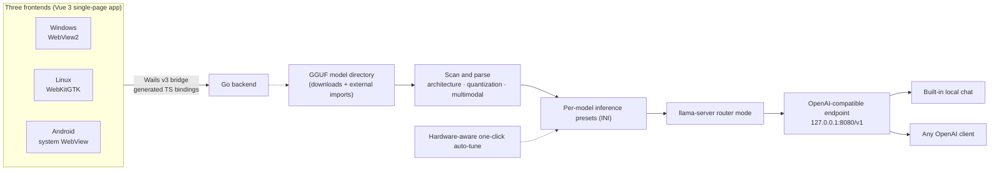

The frontend is a Vue 3 single-page app that talks to the Go backend through the Wails v3 bridge (TypeScript bindings generated at build time); the same frontend renders inside WebView2 on Windows, WebKitGTK on Linux and the system WebView on Android. The backend scans the model directories, parses GGUF metadata, generates per-model inference presets and launches llama-server. Running in router mode, llama-server serves every GGUF in the directory behind one OpenAI-compatible endpoint, loading and unloading models on demand — the built-in chat and any OpenAI client connect to that same endpoint (Android runs direct mode: one resident model, started from the Chat page).

---

## 🔨 Build from Source

- [Git](https://git-scm.com/), [Go](https://go.dev/dl/) 1.25+, [Node.js](https://nodejs.org/) 18+
- Wails v3 CLI (matching the v3 version in go.mod):

  ```bash
  go install github.com/wailsapp/wails/v3/cmd/wails3@v3.0.0-beta.16
  ```

- Platform dependencies:
  - **Windows**: WebView2 Runtime (usually preinstalled on Windows 10/11);
  - **Linux**: GTK4 and WebKitGTK 6.0 development packages, e.g. `sudo apt install libgtk-4-dev libwebkitgtk-6.0-dev pkg-config` (Debian/Ubuntu; the released `.deb` packages are built with the `-tags gtk3` variant, i.e. GTK3 + WebKit2GTK 4.1);
  - **Android**: JDK 17 plus the Android SDK / NDK (`sdkmanager "ndk;26.3.11579264" "platforms;android-35"`); see the android section of [Taskfile.yml](Taskfile.yml) and the [CI configuration](.github/workflows/ci.yml);
  - **macOS**: no prebuilt distribution; source builds work (Apple Silicon uses Metal).

Clone and build:

```bash
git clone https://github.com/CodeNeow/llama-cpp-desktop.git
cd llama-cpp-desktop
wails3 task build            # Windows / Linux / macOS desktop build
wails3 task android:package  # Android arm64 APK (build the frontend first; output in build/bin/)
```

Dev mode (Go backend + Vite frontend with hot reload, dev server pinned to `http://localhost:5173`):

```bash
wails3 task dev
```

Combined quality gate:

```bash
powershell -NoProfile -ExecutionPolicy Bypass -File .\scripts\check.ps1     # Windows
make check                                                                  # POSIX
```

The gate runs `go build` / `go test` / `gofmt` / `golangci-lint` on the backend and `npm run build` (vue-tsc + vite) on the frontend; the PowerShell script also runs the vitest suite (`npm test`). Backend tests live in `core/*_test.go` (standard library `testing`, including service-chain E2E against a real llama-server), frontend tests in `frontend/src/__tests__/`. See [AGENTS.md](AGENTS.md) and [CONTRIBUTING.md](CONTRIBUTING.md) for conventions, commit format and the collaboration workflow.

---

## ❓ FAQ

**The app reports it is already running at startup.**
The app enforces a single-instance mutex, so duplicate launches are blocked (the window also covers retries inside the headless → GUI handover window). Close any running MyLlama first (including tray-only background instances), then start it again.

**`wails3 task dev` reports the port is already in use.**
The Vite dev server binds `localhost:5173` (`VITE_PORT` in the Taskfile, overridable via the `WAILS_VITE_PORT` environment variable). End the process occupying it and retry.

**"Start Server" on the API page fails with "no models found".**
Startup scans the models directory and generates presets first, so an empty directory is an error. Put GGUF files into `LLM-Models/` (check the "My Models" tab of the Models page) and try again. Also confirm llama.cpp is installed, as shown in the "Runtime Environment" tab of the Home page.

**API calls fail with `model not found`.**
The `model` field must match the name shown in the UI exactly (the service matches case-sensitively). Copy-paste from the API page model tags or the "My Models" tab of the Models page instead of typing it by hand.

**Every backend call fails when running the frontend with `npm run dev` standalone.**
The frontend calls the Go backend through Wails v3 bindings generated at build time; Vite without `wails3 task dev` has no bridge to the backend, so calls fail at the request stage — this is expected. Use `wails3 task dev` to debug the UI with the backend attached (or `npm run dev:mock` for a browser-only preview backed by the in-repo mock).

**The Linux source build fails with missing GTK / WebKit dependencies.**
The Wails v3 Linux build goes through cgo: the default path needs the GTK4 and WebKitGTK 6.0 development packages (`libgtk-4-dev`, `libwebkitgtk-6.0-dev`), while the `-tags gtk3` variant needs `libgtk-3-dev` and `libwebkit2gtk-4.1-dev`. Install the packages matching your build variant — plus `pkg-config` — via your package manager and build again.

**Android install or in-app update fails.**
Installing the APK requires allowing "install unknown apps". In-app self-update requires the installed version and the new APK to share one signature — release APKs are signed with a stable key, while debug-signed local builds or APKs from other sources cannot upgrade each other; when signatures differ, uninstall the old version first. The app is sideload-only (not on any app store) and always fetches updates from GitHub Releases.

**Downloading llama.cpp is slow or fails.**
The download comes from GitHub Releases; it supports pause / resume with resumable transfers. On a restricted network, download the release package for your platform manually, extract it, and select the directory via "Custom" in the "Runtime Environment" tab of the Home page.

---

## 📄 License and Acknowledgements

Copyright © 2026 [CodeNeow](https://github.com/CodeNeow/llama-cpp-desktop)

This project is licensed under the [GNU General Public License v3](LICENSE).

MyLlama stands on the shoulders of these open-source projects — thank you:

- [llama.cpp](https://github.com/ggml-org/llama.cpp) (the ggml / GGUF ecosystem) — the high-performance local inference engine;
- [Wails](https://wails.io/) — the framework for building cross-platform desktop / mobile apps with Go + web technologies;
- [Vue](https://vuejs.org/) and [Vite](https://vitejs.dev/) — the frontend framework and toolchain;
- [hf-mirror.com](https://hf-mirror.com), [Hugging Face](https://huggingface.co) and [ModelScope](https://modelscope.cn) — the open model ecosystem.

Third-party model files remain the property of their respective authors; follow each model's own license when downloading and using them.
